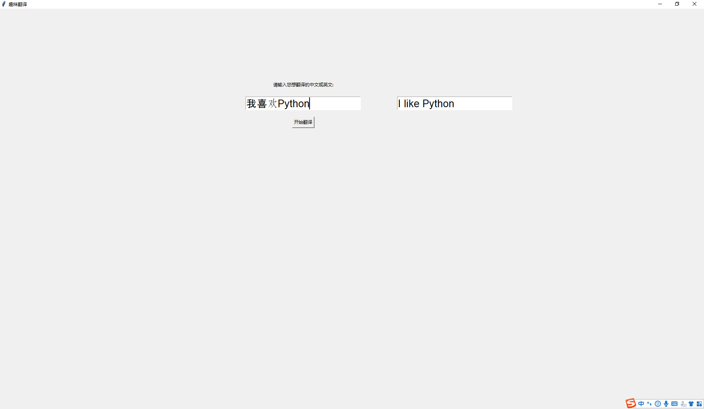

#### 中英互译

**运行效果**


**完整代码**
```python
from urllib import request
import urllib
import re
from tkinter import *
mygui = Tk(className="趣味翻译")
mygui.geometry('1000x500+200+200')#设置窗口大小及位置


header = {
'user-agent':'Mozilla/5.0 (Linux; Android 6.0; Nexus 5 Build/MRA58N) AppleWebKit/537.36 (KHTML, like Gecko) Chrome/63.0.3239.132 Mobile Safari/537.36'}

url = 'http://fanyi.youdao.com/translate?smartresult=dict&smartresult=rule'
def hit_me():
    form_date = {'i': e.get(),
    'from': 'AUTO',
    'to': 'AUTO',
    'smartresult': 'dict',
    'client': 'fanyideskweb',
    'salt': '15609295378881',
    'sign': '1df1a958a9786081377324bce340e0da',
    'ts': '1560929537888',
    'bv': '8d165ec21fcdbdde58f225cd72fd33e4',
    'doctype': 'json',
    'version': '2.1',
    'keyfrom': 'fanyi.web',
    'action': 'FY_BY_CLICKBUTTION'}

    data = urllib.parse.urlencode(form_date).encode(encoding = 'utf-8')

    req = request.Request(url,headers=header,data=data )

    reponse = request.urlopen(req).read().decode()
    print(reponse)

    patt = r'"tgt":"(.*?)"}]]}'
    result = re.findall(patt,reponse)
    print(result)
    h = StringVar()
    fy = Entry(mygui, textvariable=h, font=('Arial', 20))
    h.set(result[0])
    fy.place(x=1200, y=250, anchor=CENTER)


while True:
    l1 = Label(mygui, text="请输入您想翻译的中文或英文:")
    l1.place(x=800, y=200, anchor=CENTER)
    e = StringVar()
    word = Entry(mygui, textvariable=e, font=('Arial', 20))
    e.set('input your text here')
    word.place(x=800, y=250, anchor=CENTER)

    start = Button(mygui, text="开始翻译", command=hit_me)
    start.place(x=800, y=300, anchor=CENTER)

    mainloop()
	
```

#### 自动邮件发送
**案例来源**
> https://zhuanlan.zhihu.com/p/89868804

**完整代码**
```Python
# 1、先导入相关的库和方法
import smtplib
import email
# 负责构造文本
from email.mime.text import MIMEText
# 负责构造图片
from email.mime.image import MIMEImage
# 负责将多个对象集合起来
from email.mime.multipart import MIMEMultipart
from email.header import Header

# 2、设置邮箱域名、发件人邮箱、邮箱授权码、收件人邮箱
# SMTP服务器,这里使用163邮箱
mail_host = "smtp.163.com"
# 发件人邮箱
mail_sender = "******@163.com"
# 邮箱授权码,注意这里不是邮箱密码，授权码一般在邮箱设置中可以设置
mail_license = "******"
# 收件人邮箱，可以为多个收件人，可以多个
mail_receivers = ["******@qq.com"]

# 3、构建MIMEMultipart对象代表邮件本身，可以往里面添加文本、图片、附件等
mm = MIMEMultipart('related')

# 4、设置邮件头部内容
# 邮件主题
subject_content = """Python邮件测试"""
# 设置发送者,注意严格遵守格式,里面邮箱为发件人邮箱
mm["From"] = "cloud<******@163.com>"
# 设置接受者,注意严格遵守格式,里面邮箱为接受者邮箱,可以多个
mm["To"] = "recever<******@qq.com>"
# 设置邮件主题
mm["Subject"] = Header(subject_content,'utf-8')

# 5、添加正文文本
# 邮件正文内容
body_content = """你好，这是一个测试邮件！"""
# 构造文本,参数1：正文内容，参数2：文本格式，参数3：编码方式
message_text = MIMEText(body_content,"plain","utf-8")
# 向MIMEMultipart对象中添加文本对象
mm.attach(message_text)

# 6、添加图片
# 二进制读取图片
image_data = open('a.jpg','rb')
# 设置读取获取的二进制数据
message_image = MIMEImage(image_data.read())
# 关闭刚才打开的文件
image_data.close()
# 添加图片文件到邮件信息当中去
mm.attach(message_image)

# 7、添加附件(excel表格)
# 构造附件
atta = MIMEText(open('sample.xlsx', 'rb').read(), 'base64', 'utf-8')
# 设置附件信息
atta["Content-Disposition"] = 'attachment; filename="sample.xlsx"'
# 添加附件到邮件信息当中去
mm.attach(atta)

# 8、发送邮件
# 创建SMTP对象
stp = smtplib.SMTP()
# 设置发件人邮箱的域名和端口，端口地址为25
stp.connect(mail_host, 25)  
# set_debuglevel(1)可以打印出和SMTP服务器交互的所有信息
stp.set_debuglevel(1)
# 登录邮箱，传递参数1：邮箱地址，参数2：邮箱授权码
stp.login(mail_sender,mail_license)
# 发送邮件，传递参数1：发件人邮箱地址，参数2：收件人邮箱地址，参数3：把邮件内容格式改为str
stp.sendmail(mail_sender, mail_receivers, mm.as_string())
print("邮件发送成功")
# 关闭SMTP对象
stp.quit()
```