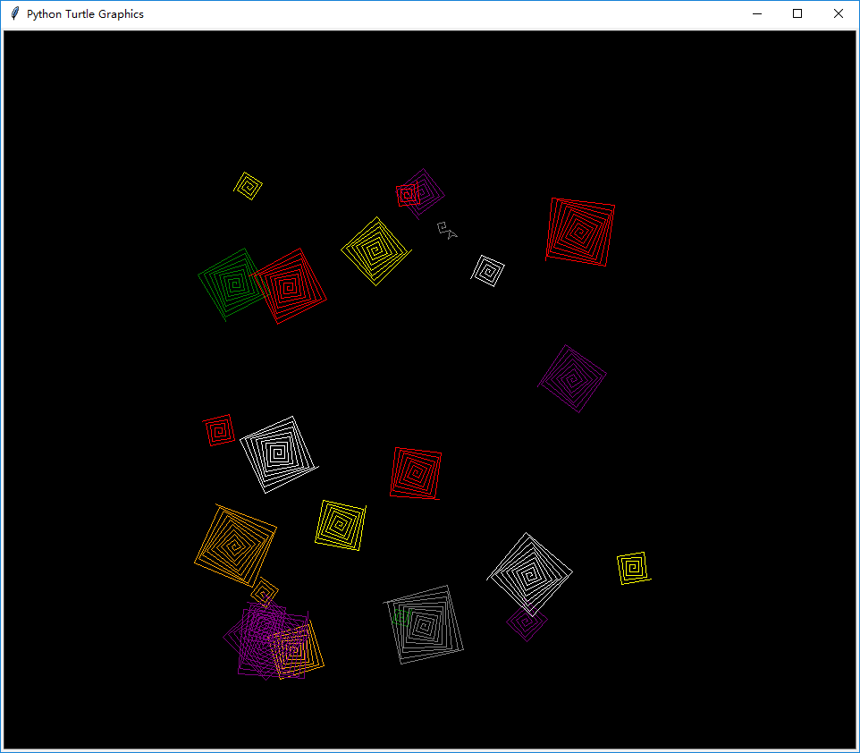
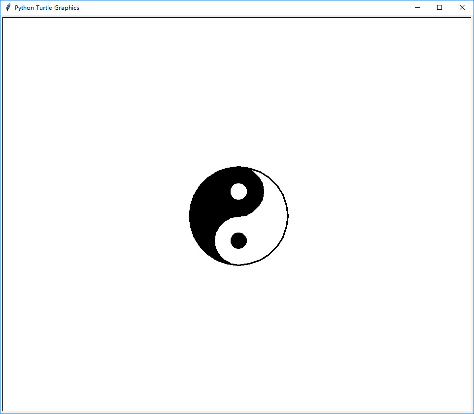
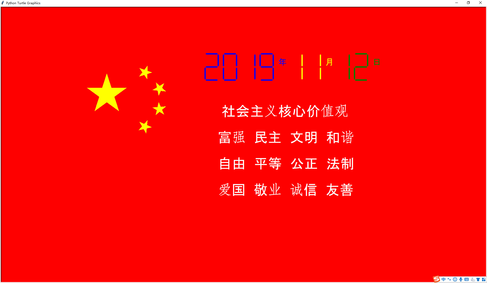

#### 随机螺旋线

**运行效果**


**完整代码**
```python
import turtle
import random

# 随机螺旋线
t = turtle.Pen()
turtle.bgcolor('black')
colors = ['red', 'yellow', 'blue', 'green', 'orange', 'purple', 'white', 'gray']
for n in range(50):
    # 选择随机的颜色
    t.pencolor(random.choice(colors))
    # 选择随机的大小（改改看看效果吧）
    size = random.randint(10, 40)
    # 在屏幕上选择随机坐标
    x = random.randint((-300), 300)
    y = random.randint((-300), 300)
    t.penup()
    t.goto(x, y)
    t.pendown()
    for m in range(size):
        t.forward((m * 2))
        # 可以试试可以更改角度看看哦
        t.left(91)

```


#### 八卦图

**运行效果**


**完整代码**
```python
import turtle

window = turtle.Screen()

bage = turtle.Turtle()

radius = 100
bage.width(3)
bage.color("black", "black")
bage.begin_fill()
bage.circle(radius/2, 180)
bage.circle(radius, 180)
bage.left(180)
bage.circle(-radius/2, 180)
bage.end_fill()

bage.left(90)
bage.up()
bage.forward(radius*0.35)
bage.right(90)
bage.down()
bage.color("white", "white")
bage.begin_fill()
bage.circle(radius*0.15)
bage.end_fill()

bage.left(90)
bage.up()
bage.backward(radius*0.7)
bage.down()
bage.left(90)
bage.color("black", "black")
bage.begin_fill()
bage.circle(radius*0.15)
bage.end_fill()

bage.right(90)
bage.up()
bage.backward(radius*0.65)
bage.right(90)
bage.down()
bage.circle(radius, 180)
bage.ht()
    
window.exitonclick()
```

#### 五星红旗

**运行效果**


**完整代码**
```python
import turtle

turtle.pensize(1)
turtle.bgcolor("red")
turtle.fillcolor("yellow")
turtle.color('yellow')
turtle.speed(5)
turtle.begin_fill()
turtle.up()
turtle.goto(-600, 220)
turtle.down()
for i in range(5):
    turtle.forward(150)
    turtle.right(144)
turtle.end_fill()


turtle.begin_fill()
turtle.up()
turtle.goto(-400, 295)
turtle.setheading(305)
turtle.down()
for i in range(5):
    turtle.forward(50)
    turtle.left(144)

turtle.end_fill()


turtle.begin_fill()
turtle.up()
turtle.goto(-350, 212)
turtle.setheading(30)
turtle.down()
for i in range(5):
    turtle.forward(50)
    turtle.right(144)

turtle.end_fill()


turtle.begin_fill()
turtle.up()
turtle.goto(-350, 145)
turtle.setheading(5)
turtle.down()
for i in range(5):
    turtle.forward(50)
    turtle.right(144)

turtle.end_fill()


turtle.begin_fill()
turtle.up()
turtle.goto(-400, 90)
turtle.setheading(300)
turtle.down()
for i in range(5):
    turtle.forward(50)
    turtle.left(144)

turtle.end_fill()
import time


turtle.color('white')
turtle.penup()
turtle.goto(-50, 200)
turtle.pendown()
turtle.left(60)
turtle.penup()
turtle.speed(5)
turtle.goto(-85, 100)
turtle.pendown()
turtle.write('社会主义核心价值观', font=('Arial', 40, 'normal'))
time.sleep(0.1)
turtle.penup()
turtle.speed(5)
turtle.goto(-100, 0)
turtle.pendown()
turtle.write('富强  民主  文明  和谐', font=('Arial', 40, 'normal'))
time.sleep(0.1)
turtle.penup()
turtle.speed(5)
turtle.goto(-100, -100)
turtle.pendown()
turtle.write('自由  平等  公正  法制', font=('Arial', 40, 'normal'))
time.sleep(0.1)
turtle.penup()
turtle.speed(5)
turtle.goto(-100, (-200))
turtle.pendown()
turtle.write('爱国  敬业  诚信  友善', font=('Arial', 40, 'normal'))

turtle.penup()
turtle.goto((150), 300)
turtle.pendown()

import turtle

import time
 
def drawGap(): 
    turtle.penup()
    turtle.fd(5)
def drawLine(draw):
    drawGap()
    turtle.pendown() if draw else turtle.penup()
    turtle.fd(40)
    drawGap()
    turtle.rt(90)
 
def drawDigit(digit):
    drawLine(True) if digit in [2,3,4,5,6,8,9] else drawLine(False)
    drawLine(True) if digit in  [0,1,3,4,5,6,7,8,9] else drawLine(False)
    drawLine(True) if digit in  [0,2,3,5,6,8,9] else drawLine(False)
    drawLine(True) if digit in [0,2,6,8] else drawLine(False)
    turtle.lt(90)
    drawLine(True) if digit in  [0,4,5,6,8,9] else drawLine(False)
    drawLine(True) if digit in  [0,2,3,5,6,7,8,9] else drawLine(False)
    drawLine(True) if digit in  [0,1,2,3,4,7,8,9] else drawLine(False)
    turtle.lt(180)
    turtle.penup()
    turtle.fd(20)
 
def drawDate(date): 
    turtle.pencolor('blue')
    for i in date:
        if i=='-':
            turtle.write('年',font=('Arial',24,'normal'))
            turtle.pencolor('yellow')
            turtle.fd(40)
        elif i=='=':
            turtle.write('月',font=('Arial',24,'normal'))
            turtle.pencolor('green')
            turtle.fd(40)
        elif i=='+':
            turtle.write('日',font=('Arial',24,'normal'))
        else:
            drawDigit(eval(i))
 
def main():
    turtle.setup(800,350,200,200)
    turtle.penup()
    turtle.fd(-300)
    turtle.pensize(5)
    drawDate(time.strftime('%Y-%m=%d+',time.gmtime()))
    turtle.hideturtle()
    turtle.done()
 
main()
```